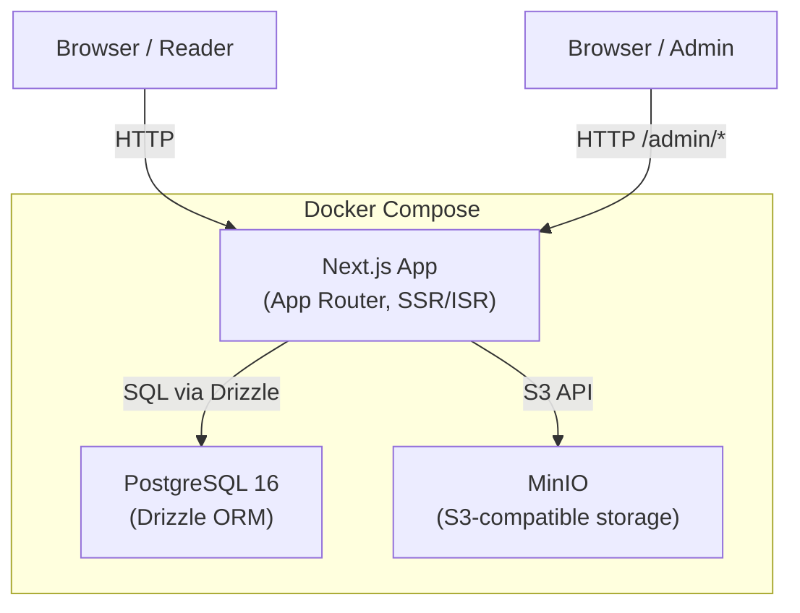
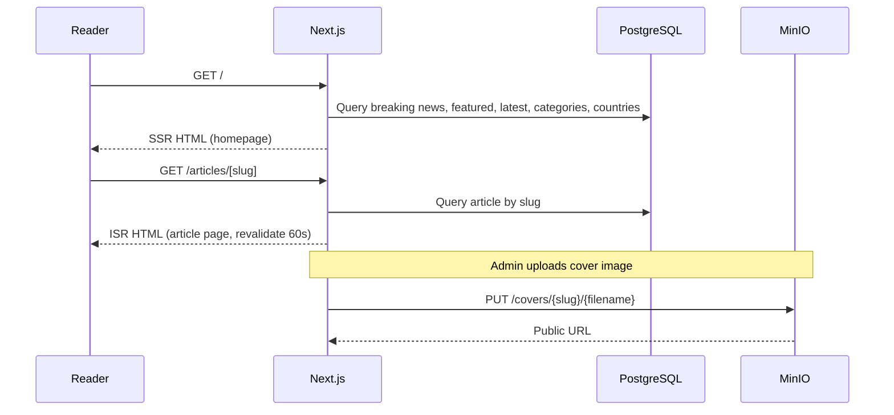
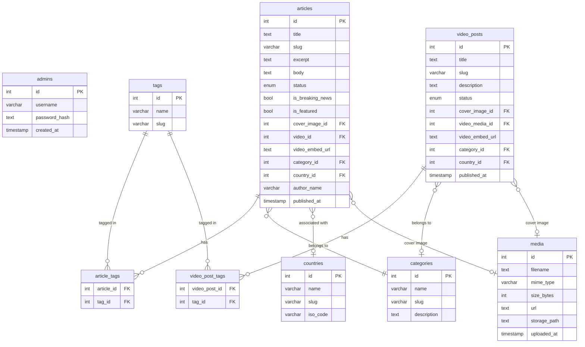

# Design Document: International Newspaper CMS

## Overview

A full-featured international newspaper platform built on Next.js 15 (App Router), Drizzle ORM + PostgreSQL, and MinIO S3-compatible storage, all orchestrated via Docker Compose. The platform has two distinct surfaces:

- **Public site** — a reader-facing newspaper with homepage, article pages, category/tag/country indexes, search, and video posts
- **CMS** — an admin-only area at `/admin` for managing all content (articles, videos, media, categories, tags, countries)

The UI follows a minimalist cream-and-black aesthetic using Tailwind CSS v4. All content is authored in a Notion-style Markdown block editor. The system is fully containerized and mobile-responsive.

---

## Architecture

### High-Level Architecture



### Request Flow



### Rendering Strategy

| Route | Strategy | Revalidation |
|---|---|---|
| `/` | SSR (dynamic) | Every request |
| `/articles/[slug]` | ISR | 60 seconds |
| `/categories/[slug]` | ISR | 60 seconds |
| `/tags/[slug]` | ISR | 60 seconds |
| `/countries/[slug]` | ISR | 60 seconds |
| `/videos/[slug]` | ISR | 60 seconds |
| `/search` | SSR (dynamic) | Every request |
| `/sitemap.xml` | ISR | 3600 seconds |
| `/admin/*` | SSR (dynamic, auth-gated) | Every request |

---

## Components and Interfaces

### Directory Structure

```
/
├── app/
│   ├── layout.tsx                    # Root layout (fonts, global nav)
│   ├── globals.css                   # Tailwind + cream/black theme vars
│   ├── page.tsx                      # Homepage (SSR)
│   ├── articles/[slug]/page.tsx      # Article detail (ISR)
│   ├── categories/[slug]/page.tsx    # Category index (ISR)
│   ├── tags/[slug]/page.tsx          # Tag index (ISR)
│   ├── countries/[slug]/page.tsx     # Country index (ISR)
│   ├── videos/[slug]/page.tsx        # Video post (ISR)
│   ├── search/page.tsx               # Search results (SSR)
│   ├── sitemap.ts                    # Next.js sitemap generator
│   ├── robots.ts                     # Next.js robots.txt generator
│   └── admin/
│       ├── layout.tsx                # Admin layout (auth check)
│       ├── login/page.tsx            # Login page
│       ├── page.tsx                  # Dashboard overview
│       ├── articles/
│       │   ├── page.tsx              # Article list
│       │   ├── new/page.tsx          # New article editor
│       │   └── [id]/edit/page.tsx    # Edit article editor
│       ├── videos/
│       │   ├── page.tsx              # Video post list
│       │   ├── new/page.tsx          # New video post
│       │   └── [id]/edit/page.tsx    # Edit video post
│       ├── media/page.tsx            # Media library
│       ├── categories/page.tsx       # Category CRUD
│       ├── tags/page.tsx             # Tag CRUD
│       └── countries/page.tsx        # Country CRUD
├── components/
│   ├── public/
│   │   ├── BreakingNewsTicker.tsx
│   │   ├── ArticleCard.tsx
│   │   ├── VideoCard.tsx
│   │   ├── Pagination.tsx
│   │   ├── NavBar.tsx
│   │   └── Footer.tsx
│   └── admin/
│       ├── MarkdownEditor.tsx        # Notion-style block editor
│       ├── MediaUpload.tsx           # File upload with MinIO
│       ├── ArticleForm.tsx
│       ├── VideoPostForm.tsx
│       └── TaxonomyForm.tsx          # Shared form for category/tag/country
├── lib/
│   ├── db/
│   │   ├── schema.ts                 # Drizzle schema definitions
│   │   ├── index.ts                  # DB client singleton
│   │   └── migrations/               # Drizzle migration files
│   ├── queries/
│   │   ├── articles.ts               # Article query functions
│   │   ├── videos.ts                 # Video query functions
│   │   ├── taxonomy.ts               # Category/tag/country queries
│   │   └── search.ts                 # Full-text search queries
│   ├── minio.ts                      # MinIO client + upload helpers
│   ├── auth.ts                       # Session management (iron-session or jose)
│   ├── slugify.ts                    # Slug generation utility
│   └── markdown.ts                   # Markdown → HTML renderer (remark/rehype)
└── app/api/
    ├── admin/upload/route.ts         # POST: upload media to MinIO
    ├── admin/articles/route.ts       # POST: create article
    ├── admin/articles/[id]/route.ts  # PUT/DELETE: update/delete article
    ├── admin/videos/route.ts         # POST: create video post
    ├── admin/videos/[id]/route.ts    # PUT/DELETE
    ├── admin/media/[id]/route.ts     # DELETE: remove media asset
    ├── admin/categories/route.ts     # CRUD
    ├── admin/tags/route.ts           # CRUD
    └── admin/countries/route.ts      # CRUD
```

### Key Component Interfaces

```typescript
// ArticleCard props
interface ArticleCardProps {
  title: string;
  slug: string;
  excerpt: string | null;
  coverImageUrl: string | null;
  category: { name: string; slug: string };
  publishedAt: Date;
  variant?: "featured" | "compact" | "default";
}

// MarkdownEditor props
interface MarkdownEditorProps {
  value: string;
  onChange: (markdown: string) => void;
  onImageUpload: (file: File) => Promise<string>; // returns URL
}

// MediaUpload props
interface MediaUploadProps {
  accept: "image" | "video";
  onUpload: (url: string, mediaId: number) => void;
  currentUrl?: string;
}

// Pagination props
interface PaginationProps {
  currentPage: number;
  totalPages: number;
  basePath: string;
}
```

### API Route Contracts

```typescript
// POST /api/admin/upload
// Request: FormData { file: File, type: "cover" | "video" | "body", slug: string }
// Response: { url: string; mediaId: number }

// POST /api/admin/articles
// Request: ArticleCreateInput
// Response: { id: number; slug: string }

// PUT /api/admin/articles/[id]
// Request: Partial<ArticleCreateInput>
// Response: { id: number }

// DELETE /api/admin/articles/[id]
// Response: { success: true }
```

---

## Data Models

### Drizzle Schema

```typescript
// lib/db/schema.ts

import { pgTable, serial, text, integer, boolean, timestamp, pgEnum, varchar } from "drizzle-orm/pg-core";

export const publicationStatusEnum = pgEnum("publication_status", ["draft", "published", "archived"]);

export const admins = pgTable("admins", {
  id: serial("id").primaryKey(),
  username: varchar("username", { length: 100 }).notNull().unique(),
  passwordHash: text("password_hash").notNull(),
  createdAt: timestamp("created_at").defaultNow().notNull(),
});

export const categories = pgTable("categories", {
  id: serial("id").primaryKey(),
  name: varchar("name", { length: 100 }).notNull(),
  slug: varchar("slug", { length: 120 }).notNull().unique(),
  description: text("description"),
  createdAt: timestamp("created_at").defaultNow().notNull(),
});

export const tags = pgTable("tags", {
  id: serial("id").primaryKey(),
  name: varchar("name", { length: 100 }).notNull(),
  slug: varchar("slug", { length: 120 }).notNull().unique(),
  createdAt: timestamp("created_at").defaultNow().notNull(),
});

export const countries = pgTable("countries", {
  id: serial("id").primaryKey(),
  name: varchar("name", { length: 100 }).notNull(),
  slug: varchar("slug", { length: 120 }).notNull().unique(),
  isoCode: varchar("iso_code", { length: 2 }).notNull().unique(), // ISO 3166-1 alpha-2
  createdAt: timestamp("created_at").defaultNow().notNull(),
});

export const media = pgTable("media", {
  id: serial("id").primaryKey(),
  filename: text("filename").notNull(),
  mimeType: varchar("mime_type", { length: 100 }).notNull(),
  sizeBytes: integer("size_bytes").notNull(),
  url: text("url").notNull(),
  storagePath: text("storage_path").notNull(), // MinIO object key
  uploadedAt: timestamp("uploaded_at").defaultNow().notNull(),
});

export const articles = pgTable("articles", {
  id: serial("id").primaryKey(),
  title: text("title").notNull(),
  slug: varchar("slug", { length: 200 }).notNull().unique(),
  excerpt: text("excerpt"),
  body: text("body").notNull(), // Markdown source
  status: publicationStatusEnum("status").default("draft").notNull(),
  isBreakingNews: boolean("is_breaking_news").default(false).notNull(),
  isFeatured: boolean("is_featured").default(false).notNull(),
  coverImageId: integer("cover_image_id").references(() => media.id, { onDelete: "set null" }),
  videoId: integer("video_id").references(() => media.id, { onDelete: "set null" }),
  videoEmbedUrl: text("video_embed_url"),
  categoryId: integer("category_id").notNull().references(() => categories.id),
  countryId: integer("country_id").references(() => countries.id),
  authorName: varchar("author_name", { length: 200 }).notNull(),
  publishedAt: timestamp("published_at"),
  createdAt: timestamp("created_at").defaultNow().notNull(),
  updatedAt: timestamp("updated_at").defaultNow().notNull(),
});

export const articleTags = pgTable("article_tags", {
  articleId: integer("article_id").notNull().references(() => articles.id, { onDelete: "cascade" }),
  tagId: integer("tag_id").notNull().references(() => tags.id, { onDelete: "cascade" }),
});

export const videoPosts = pgTable("video_posts", {
  id: serial("id").primaryKey(),
  title: text("title").notNull(),
  slug: varchar("slug", { length: 200 }).notNull().unique(),
  description: text("description"),
  status: publicationStatusEnum("status").default("draft").notNull(),
  coverImageId: integer("cover_image_id").references(() => media.id, { onDelete: "set null" }),
  videoMediaId: integer("video_media_id").references(() => media.id, { onDelete: "set null" }),
  videoEmbedUrl: text("video_embed_url"),
  categoryId: integer("category_id").references(() => categories.id),
  countryId: integer("country_id").references(() => countries.id),
  publishedAt: timestamp("published_at"),
  createdAt: timestamp("created_at").defaultNow().notNull(),
  updatedAt: timestamp("updated_at").defaultNow().notNull(),
});

export const videoPostTags = pgTable("video_post_tags", {
  videoPostId: integer("video_post_id").notNull().references(() => videoPosts.id, { onDelete: "cascade" }),
  tagId: integer("tag_id").notNull().references(() => tags.id, { onDelete: "cascade" }),
});
```

### Entity Relationship Diagram



### Session Model

Sessions are stored as signed HTTP-only cookies using `iron-session` or `jose`. No server-side session store is required.

```typescript
interface AdminSession {
  adminId: number;
  username: string;
}
```

### MinIO Storage Layout

```
bucket: newspaper-media
├── covers/{article-slug}/{filename}
├── videos/{article-slug}/{filename}
└── body/{article-slug}/{filename}   # inline editor images
```

---

## Correctness Properties

*A property is a characteristic or behavior that should hold true across all valid executions of a system — essentially, a formal statement about what the system should do. Properties serve as the bridge between human-readable specifications and machine-verifiable correctness guarantees.*


### Property 1: Breaking news query returns only flagged articles in descending date order

*For any* set of articles with mixed `is_breaking_news` values and publication dates, the breaking news query must return only articles where `is_breaking_news = true` and `status = published`, ordered by `publishedAt` descending. When no such articles exist, the result must be an empty array.

**Validates: Requirements 1.1, 1.9**

### Property 2: Homepage section queries return at most N articles

*For any* set of published articles, the "Today's Features" query returns at most 5 featured articles, the "Latest News" query returns at most 10 articles, the "By Category" query returns at most 4 articles per category, and the "World News" query returns at most 3 articles per country — all ordered by `publishedAt` descending.

**Validates: Requirements 1.2, 1.3, 1.4, 1.5**

### Property 3: Only published articles appear in public-facing queries

*For any* set of articles with statuses `draft`, `published`, or `archived`, every public query (homepage sections, category/tag/country index, article detail, search) must return only articles where `status = published`. Draft and archived articles must never appear in public results.

**Validates: Requirements 2.5, 6.6**

### Property 4: Article metadata fields are present in query results

*For any* published article, the article detail query must return all required fields: title, cover image URL, author name, publication date, category, country, and tags. No required field may be null or missing for a published article that has them set.

**Validates: Requirements 2.1**

### Property 5: Markdown round-trip rendering

*For any* Markdown string containing supported block types (headings H1–H3, paragraphs, bold, italic, blockquotes, ordered lists, unordered lists, inline code, code blocks), rendering it to HTML and back-parsing the structure must preserve the semantic content. The rendered HTML must contain the expected HTML elements for each block type.

**Validates: Requirements 2.2**

### Property 6: Related articles exclude the current article and respect category

*For any* article A in category C, the related articles query must return only published articles in category C where `id ≠ A.id`, with at most 4 results.

**Validates: Requirements 2.4**

### Property 7: Missing or non-published slug returns null from query

*For any* slug that does not exist in the database, or any slug whose article/video/category/tag/country has a non-published status, the corresponding lookup query must return `null` (resulting in a 404 response).

**Validates: Requirements 2.5, 3.7**

### Property 8: Taxonomy index queries return only published articles, paginated

*For any* category, tag, or country slug and page number, the index query must return only published articles associated with that taxonomy entity, ordered by `publishedAt` descending, with at most 20 results per page and a correct total count.

**Validates: Requirements 3.1, 3.2, 3.3, 3.8**

### Property 9: Taxonomy header data contains required fields

*For any* category, the header query returns name, description, and article count. For any tag, it returns name and article count. For any country, it returns name, ISO code, and article count.

**Validates: Requirements 3.4, 3.5, 3.6**

### Property 10: Search returns only published articles matching the query

*For any* search query string, the search function must return only published articles whose title or body contains the query string (case-insensitive). Articles that do not contain the query in either field must not appear in results.

**Validates: Requirements 4.1, 4.3**

### Property 11: Unauthenticated requests to admin routes are rejected

*For any* request to any `/admin/*` route without a valid session cookie, the auth middleware must return a redirect response to `/admin/login`. No admin data must be returned to unauthenticated callers.

**Validates: Requirements 5.1**

### Property 12: Password hashing is non-reversible and bcrypt-verifiable

*For any* plaintext password string, the stored hash must not equal the plaintext, must be a valid bcrypt hash (identifiable by `$2b$` prefix), must use a cost factor ≥ 12, and `bcrypt.compare(plaintext, hash)` must return `true`.

**Validates: Requirements 5.5**

### Property 13: Login round-trip — valid credentials create a session, invalid do not

*For any* admin record, submitting the correct username and password to the login handler must return a valid session object. Submitting an incorrect password or a non-existent username must return `null` (no session created).

**Validates: Requirements 5.2, 5.3, 5.4**

### Property 14: Article save validation rejects incomplete records

*For any* article input where title, body, category, or slug is empty or whitespace-only, the validation function must return a validation error and must not persist the record. Valid inputs (all required fields non-empty) must pass validation.

**Validates: Requirements 6.3**

### Property 15: Slug uniqueness is enforced across articles

*For any* two distinct articles, their slugs must differ. Attempting to save an article with a slug already used by a different article must return a conflict error.

**Validates: Requirements 6.4**

### Property 16: Publish action sets status and timestamp atomically

*For any* article in `draft` or `archived` status, calling the publish action must set `status = published` and set `publishedAt` to a non-null timestamp. The timestamp must be within a reasonable window of the current time.

**Validates: Requirements 6.5**

### Property 17: Media upload validation rejects invalid type or oversized files

*For any* file upload, if the MIME type is not in the allowed set (images: JPEG/PNG/WebP/GIF; videos: MP4/WebM) or the file size exceeds the limit (images: 20 MB; videos: 500 MB), the upload handler must return an error and must not store the file in MinIO.

**Validates: Requirements 7.3, 7.4, 7.5, 7.6**

### Property 18: Media stored at correct MinIO path

*For any* file upload with a given type (`cover`, `video`, `body`) and article slug, the resulting MinIO storage path must match the pattern `/{type}s/{slug}/{filename}`. The returned URL must be publicly accessible and contain the storage path.

**Validates: Requirements 7.1, 7.2, 6.9**

### Property 19: Slug generation produces valid URL-safe strings

*For any* name string (for a category, tag, country, or article title), the `slugify` function must return a string containing only lowercase alphanumeric characters and hyphens, with no leading/trailing hyphens, and no consecutive hyphens.

**Validates: Requirements 8.2, 8.3, 8.4**

### Property 20: Tag deletion disassociates from articles without deleting them

*For any* tag T associated with a set of articles, deleting T must remove all `article_tags` records for T, but all previously associated articles must still exist in the database with their other data intact.

**Validates: Requirements 8.7**

### Property 21: Video post render type matches source type

*For any* video post, if `videoMediaId` is set (uploaded file), the render output must include an HTML5 `<video>` element. If `videoEmbedUrl` is set (external URL), the render output must include an `<iframe>` element. These two cases must be mutually exclusive in the rendered output.

**Validates: Requirements 9.2, 9.5**

### Property 22: Sitemap contains all published content URLs

*For any* set of published articles, categories, tags, and countries, the generated sitemap must contain a `<url>` entry for each one. No unpublished article URLs must appear in the sitemap.

**Validates: Requirements 11.3**

### Property 23: JSON-LD structured data contains required NewsArticle fields

*For any* published article, the generated JSON-LD block must be a valid `NewsArticle` schema object containing `headline` (from title), `description` (from excerpt), and `image` (from cover image URL).

**Validates: Requirements 11.5**

---

## Error Handling

### Database Errors

- All Drizzle queries are wrapped in try/catch; unexpected DB errors return HTTP 500 with a generic message — no stack traces exposed to clients.
- Unique constraint violations (duplicate slug) are caught and returned as HTTP 409 Conflict with a descriptive message.
- Foreign key violations (e.g., deleting a category with articles) are caught and returned as HTTP 422 with a warning message.

### Media Upload Errors

- File size and MIME type are validated before the MinIO PUT request. Validation errors return HTTP 400 with the specific reason.
- MinIO connectivity failures return HTTP 503. The error is logged server-side.
- Partial uploads (MinIO PUT fails mid-stream) do not create a `media` DB record — the DB insert only happens after a successful MinIO PUT.

### Authentication Errors

- Invalid session cookies are treated as unauthenticated — the middleware redirects to `/admin/login` without exposing session details.
- Brute-force protection is out of scope for v1 but the login handler adds a constant-time delay via `bcrypt.compare` regardless of whether the username exists.

### 404 Handling

- All public dynamic routes (`/articles/[slug]`, `/categories/[slug]`, etc.) call `notFound()` from `next/navigation` when the query returns `null`, triggering Next.js's built-in 404 page.

### Validation Errors

- Server Actions and API routes return structured error objects: `{ error: string; field?: string }`.
- Client-side forms display field-level error messages inline.

---

## Testing Strategy

### Dual Testing Approach

Both unit tests and property-based tests are required. They are complementary:

- **Unit tests** cover specific examples, integration points, and edge cases.
- **Property-based tests** verify universal correctness across randomized inputs.

### Property-Based Testing

**Library**: [`fast-check`](https://github.com/dubzzz/fast-check) (TypeScript-native, works with Vitest/Jest)

**Configuration**: Each property test runs a minimum of **100 iterations**.

**Tag format**: Each test is annotated with a comment:
```
// Feature: international-newspaper-cms, Property N: <property_text>
```

Each correctness property defined above maps to exactly one property-based test. Examples:

```typescript
// Feature: international-newspaper-cms, Property 19: Slug generation produces valid URL-safe strings
it("slugify produces valid URL-safe strings", () => {
  fc.assert(
    fc.property(fc.string({ minLength: 1 }), (name) => {
      const slug = slugify(name);
      expect(slug).toMatch(/^[a-z0-9]+(-[a-z0-9]+)*$/);
    }),
    { numRuns: 100 }
  );
});

// Feature: international-newspaper-cms, Property 12: Password hashing is non-reversible and bcrypt-verifiable
it("bcrypt hash is non-reversible and verifiable", async () => {
  await fc.assert(
    fc.asyncProperty(fc.string({ minLength: 8, maxLength: 72 }), async (password) => {
      const hash = await hashPassword(password);
      expect(hash).not.toBe(password);
      expect(hash).toMatch(/^\$2b\$/);
      expect(await bcrypt.compare(password, hash)).toBe(true);
    }),
    { numRuns: 100 }
  );
});
```

### Unit Testing

**Library**: Vitest (zero-config with Next.js, fast)

Unit tests focus on:
- Specific examples for query functions (e.g., "given these 3 articles, latest news returns these 2")
- Integration between components (e.g., ArticleForm submits correct payload)
- Edge cases: empty search query, article with no tags, video post with no cover image
- Error conditions: duplicate slug, oversized file, invalid MIME type

### Test File Layout

```
lib/
├── __tests__/
│   ├── slugify.test.ts          # Property + unit tests for slug generation
│   ├── markdown.test.ts         # Property tests for Markdown rendering
│   ├── auth.test.ts             # Property + unit tests for auth functions
│   ├── media-validation.test.ts # Property tests for upload validation
│   └── queries/
│       ├── articles.test.ts     # Unit + property tests for article queries
│       ├── taxonomy.test.ts     # Unit + property tests for taxonomy queries
│       └── search.test.ts       # Property tests for search
```
